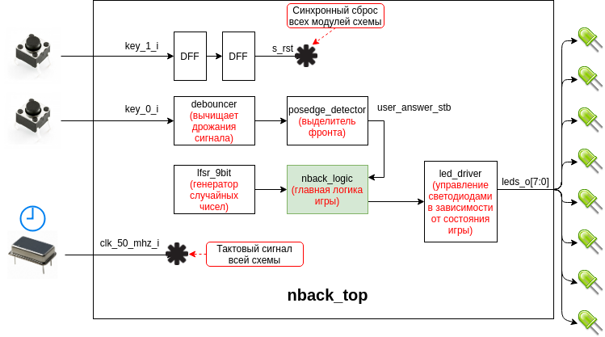

# Demo-проект игры N-back на отладочной плате DE0-Nano

## Правила игры

Нужно нажать KEY0 в тот момент, когда состояние светодиодов соответствуют тем,
что были 3 символа назад.

Игра начинается с того, что все светодиоды не горят 4 секунды.
После этого 4 секунды показывается символ №0.
Потом все светодиоды гаснут и через 4 секунды загорается символ №1 и так далее.

Игра завершается, когда показывается символ, который был показан 3 символа
назад.

Если во время показа этого символа нажать KEY0 -- это считается победой и 
светодиоды будут последовательно загораться друг за другом.
Если не нажать ничего (или нажать KEY0 во время показа другого символа),
то это считается поражением и светодиоды будут мигать и гаснуть все одновременно.

Перед началом игры нужно нажать KEY1 чтобы сбросить счетчик генератора ПСП.

## Схема проекта

## Особенности:

  * Для генерации случайных чисел используется LFSR x^9 + x^4 + 1. Но чтобы игра
была интереснее -- после показа первых 4 символов игры с вероятностью 25% новый
символ будет повторять тот, который был 3 символа назад (то есть игра
завершится).
  * Перед стартом игры её обязательно нужно сбросить клавишей KEY1.
  * N можно поменять, изменив параметр N модуля nback_logic.
